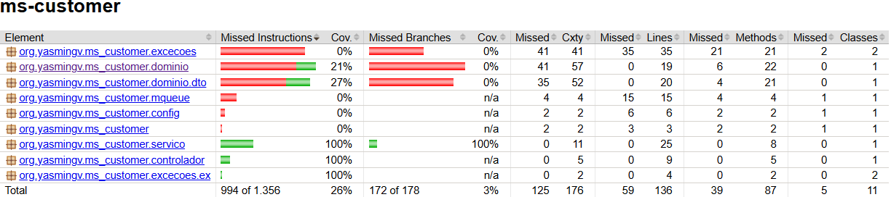
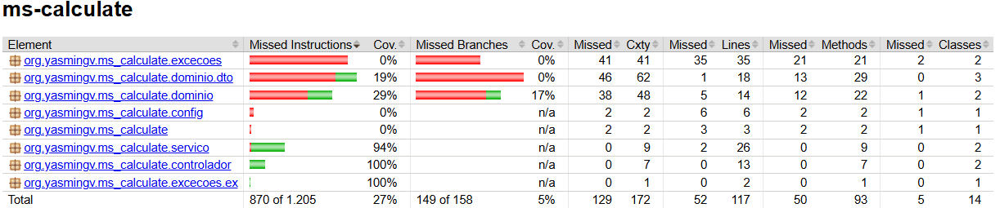
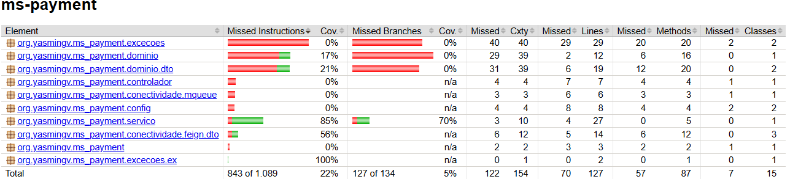

# PB Springboot Abril - Desafio 3: Banco Americano

## Descrição
Este projeto é um desafio para criar uma aplicação para o Banco Americano, implementando um programa de recompensa digital. O programa permite que os clientes acumulem pontos com base nas compras feitas com cartões de crédito do banco.

## Funcionalidades Principais
- Criar clientes
- Definir e gerenciar regras de acumulação de pontos
- Calcular pontos acumulados em cada compra
- Simular e registrar pagamentos de compras com cartão de crédito

## Tecnologias Utilizadas
- Java 17
- Spring Boot
- MySQL
- Docker
- Swagger
- RabbitMQ
- AWS

## Micro-serviços
### MS Customer
Responsável por armazenar os dados do usuário e seu total de pontos acumulados.

### MS Calculate
Responsável por calcular os pontos que serão acumulados em uma compra, baseado nas regras definidas.

### MS Payment
Responsável por simular o pagamento de uma compra com cartão de crédito do cliente. Após salvar o pagamento no banco de dados, o ms-payment envia uma mensagem ao ms-calculate para calcular o total de pontos acumulados. Em seguida, envia uma mensagem via RabbitMQ ao ms-customer com os pontos atualizados do cliente.

